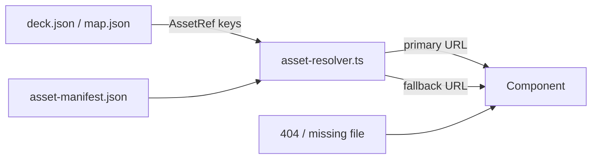

# Dubai Mall Sales Deck — Asset Folder Mapping System

**Rule:** No component may use raw `/images/...` or `/videos/...` paths.  
All media is declared in `public/data/asset-manifest.json`.  
All content JSON uses **AssetRef** keys (dot notation) that resolve through the manifest.

---

## Directory tree (locked)

```
public/
  data/
    asset-manifest.json    ← SINGLE SOURCE OF TRUTH
    asset-manifest.schema.json
    deck.json
    attractions.json
    dining.json
    retail.json
    stats.json
    map.json
  videos/
    hero/
    ambient/
    attractions/
    dining/
    retail/
    transitions/
    placeholders/
  images/
    hero/
    attractions/
    dining/
    retail/
    experiences/
    stats/
    logos/
    map/
    team/
    ui/
    placeholders/
  audio/

src/
  types/                   ← TypeScript schemas (manifest, deck, map)
  lib/
    asset-resolver.ts      ← resolveRef(), resolveImage(), resolveVideo()
  components/              ← (UI — next phase)
  pages/
  hooks/
  styles/
```

---

## Resolution flow



1. Data file contains `"video": "hero.video"` (not a path).
2. Resolver walks manifest: `manifest.hero.video` → `/videos/hero/intro.mp4`.
3. If load fails at runtime, use paired `hero.videoFallback` or `manifest.fallbacks.*`.

---

## AssetRef convention

| Pattern | Example | Resolves to |
|---------|---------|-------------|
| `section.key` | `hero.poster` | `manifest.hero.poster` |
| `section.item.field` | `attractions.dubai-aquarium.image` | Nested attraction media |
| `hubZones.zone.field` | `hubZones.aquarium.preview` | Indirect ref → another AssetRef string |

**Hub zone previews** in `hubZones` store **refs to refs** (e.g. `"attractions.dubai-aquarium.image"`). Resolver must resolve twice or flatten at build time in UI phase.

---

## Complete file → manifest key map

### Hero
| File on disk | Manifest key |
|--------------|--------------|
| `public/videos/hero/intro.mp4` | `hero.video` |
| `public/videos/hero/intro-poster-loop.mp4` | `hero.loop` |
| `public/images/hero/hero-main.jpg` | `hero.poster` |
| `public/images/hero/hero-atrium.jpg` | `hero.atrium` |
| `public/images/hero/hero-exterior.jpg` | `hero.exterior` |

### Ambient (hub + chapters)
| File | Manifest key |
|------|--------------|
| `public/videos/ambient/zone-hub.mp4` | `ambient.hub` |
| `public/videos/ambient/zone-attractions.mp4` | `ambient.attractions` |
| `public/videos/ambient/zone-dining.mp4` | `ambient.dining` |
| `public/videos/ambient/zone-retail.mp4` | `ambient.retail` |
| `public/videos/ambient/zone-leasing.mp4` | `ambient.leasing` |

### Attractions videos & images
| Attraction | Video key | Image key |
|------------|-----------|-----------|
| Dubai Aquarium | `attractions.dubai-aquarium.video` | `attractions.dubai-aquarium.image` |
| Underwater Zoo | `attractions.underwater-zoo.video` | `attractions.underwater-zoo.image` |
| Dubai Fountain | `attractions.dubai-fountain.video` | `attractions.dubai-fountain.image` |
| Ice Rink | `attractions.ice-rink.video` | `attractions.ice-rink.image` |
| VR Park | `attractions.vr-park.video` | `attractions.vr-park.image` |
| Souk | `attractions.souq.video` | `attractions.souq.image` |
| Events | `attractions.events.video` | `attractions.events.image` |

### Dining
| File | Manifest key |
|------|--------------|
| `public/videos/dining/dining-boulevard.mp4` | `dining.overview.video`, `dining.boulevard.video` |
| `public/images/dining/dining-hero.jpg` | `dining.overview.image` |
| `public/images/dining/dining-boulevard.jpg` | `dining.boulevard.image` |
| `public/images/dining/restaurant-signature-01.jpg` | `dining.signature-01.image` |
| `public/images/dining/restaurant-signature-02.jpg` | `dining.signature-02.image` |
| `public/images/dining/dining-variety.jpg` | `dining.variety.image` |

### Retail
| File | Manifest key |
|------|--------------|
| `public/videos/retail/fashion-avenue.mp4` | `retail.overview.video`, `retail.fashion-avenue.video` |
| `public/images/retail/fashion-avenue.jpg` | `retail.fashion-avenue.image` |
| `public/images/retail/luxury-wing.jpg` | `retail.luxury-wing.image` |
| `public/images/retail/retail-hero.jpg` | `retail.overview.image` |

### Map & hub zones
| Hub zone ID | Preview ref | Ambient ref | Chapter route |
|-------------|-------------|-------------|---------------|
| `aquarium` | `hubZones.aquarium.preview` | `hubZones.aquarium.ambient` | `/attractions` |
| `fashion-avenue` | `hubZones.fashion-avenue.preview` | `hubZones.fashion-avenue.ambient` | `/retail` |
| `ice-rink` | `hubZones.ice-rink.preview` | `hubZones.ice-rink.ambient` | `/attractions` |
| `vr-park` | `hubZones.vr-park.preview` | `hubZones.vr-park.ambient` | `/attractions` |
| `dining` | `hubZones.dining.preview` | `hubZones.dining.ambient` | `/dining` |
| `souk` | `hubZones.souk.preview` | `hubZones.souk.ambient` | `/retail` |
| `fountain` | `hubZones.fountain.preview` | `hubZones.fountain.ambient` | `/attractions` |

Zone positions live in `public/data/map.json` (percent x/y).

### Global fallbacks
| Key | Path |
|-----|------|
| `fallbacks.image` | `/images/placeholders/placeholder-16x9.svg` |
| `fallbacks.video` | `/videos/placeholders/gradient-loop.mp4` |
| `fallbacks.logo` | `/images/logos/dubai-mall-mark.svg` |

Every primary asset has a sibling `*Fallback` key in the manifest.

---

## Data file responsibilities

| File | Purpose |
|------|---------|
| `deck.json` | Chapters, routes, preload lists, navigation refs |
| `attractions.json` | 7 Dubai Mall attractions (manifest refs only) |
| `dining.json` | Dining Boulevard + signatures |
| `retail.json` | Fashion Avenue + luxury |
| `stats.json` | Scale metrics + background refs |
| `map.json` | Hub zones, coordinates, CTA routes |

---

## Swapping real assets

1. Drop file into the path from the table above (same filename).
2. Do **not** change JSON unless adding a new section.
3. Optional: add new manifest entries + data items together.

---

## UI phase (upcoming)

```ts
// ✅ Allowed
const { primary, fallback } = resolveVideo(manifest, 'hero.video', 'hero.videoFallback');

// ❌ Forbidden
<video src="/videos/hero/intro.mp4" />
```
